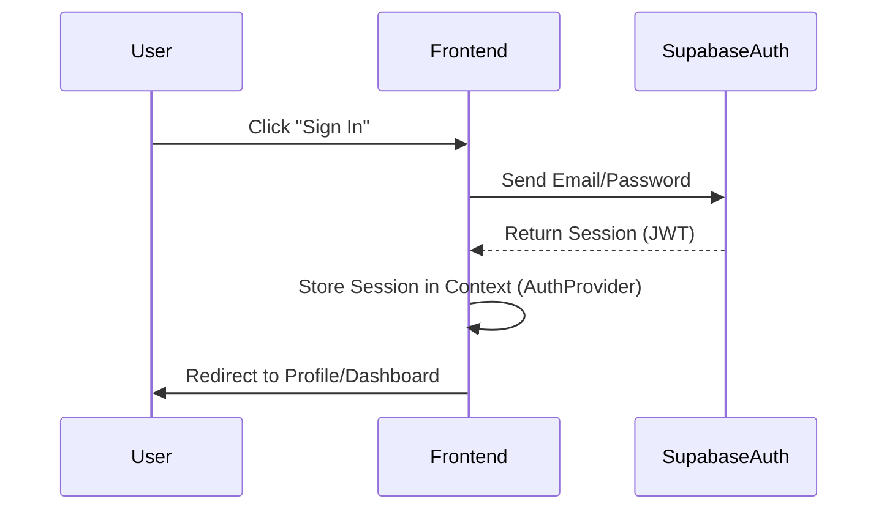
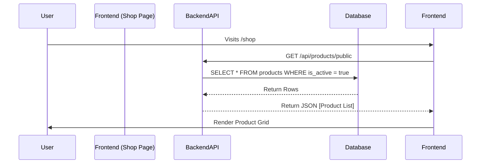
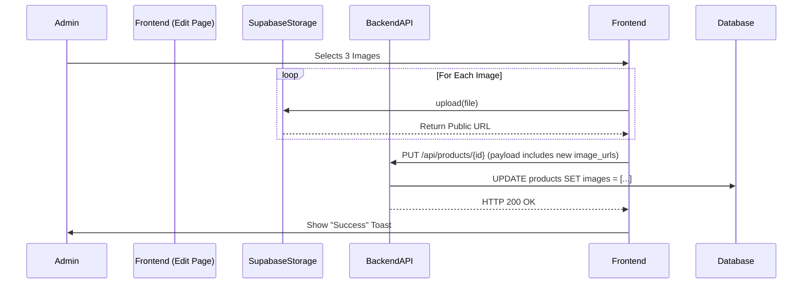

# 04. Data Flow diagrams

## 1. User Authentication Flow

## 2. Product Fetch Flow (Public Shop)

## 3. Image Upload Flow (Admin Dashboard)

## 4. Add to Cart Flow
1.  User clicks "Add to Cart".
2.  `CartProvider` receives request.
3.  Check if item exists in `cartItems`.
    -   **Yes:** Increment quantity (validate against max stock).
    -   **No:** Push new object `{ product, quantity: 1 }`.
4.  Update `localStorage`.
5.  Trigger React re-render to update Cart Icon badge in Navbar.
